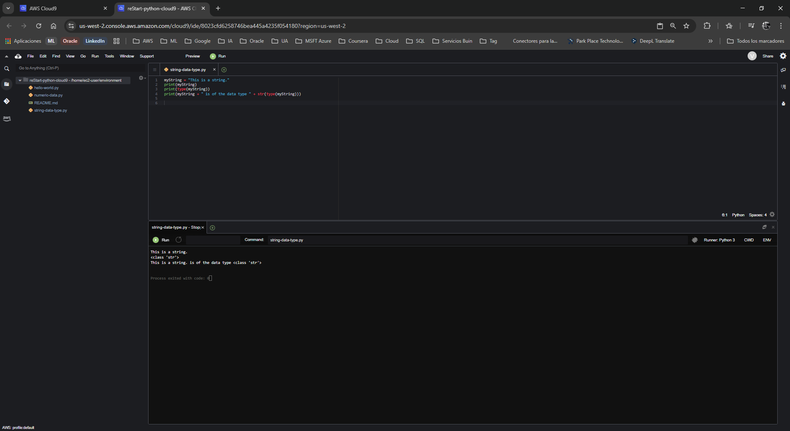
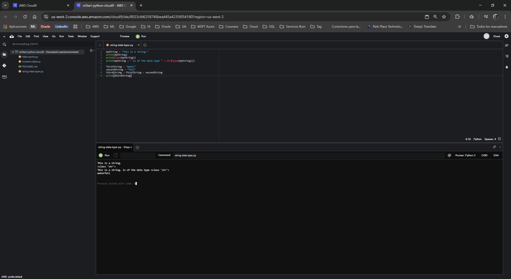
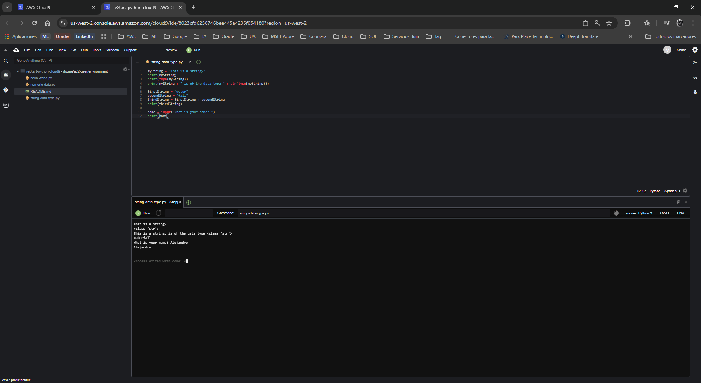
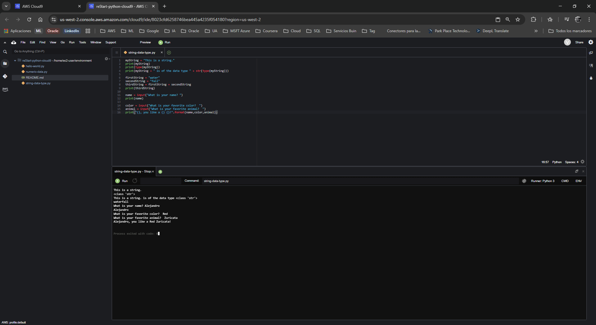

# Laboratorio: Trabajando con el Tipo de Dato String en Python

**Dificultad:** Introductoria

**Tiempo Estimado:** 45 minutos

**Servicios Principales:** AWS Cloud9, AWS Management Console

---

## 🎯 Resumen y Objetivos

En Python, una colección de letras, números y símbolos se denomina cadena de texto o *string*. Las cadenas se utilizan constantemente para procesar la entrada y salida de datos en las aplicaciones. En este laboratorio, explorarás cómo manipular texto de forma dinámica. Al finalizar esta práctica, serás capaz de:
* Declarar y utilizar el tipo de dato *string*.
* Concatenar (unir) múltiples cadenas de texto.
* Capturar la entrada del usuario interactiva utilizando la función `input()`.
* Formatear cadenas de salida combinando texto estático y variables dinámicas.

---

## 🔬 Análisis del Escenario

Como Ingeniero de Soporte Cloud, el diagnóstico de este ejercicio indica la necesidad de entrenar al cliente en la manipulación de datos alfanuméricos (texto). En la automatización de AWS y el scripting general, los *strings* son fundamentales para construir rutas de archivos, generar mensajes de registro (logs), y procesar información proporcionada por los usuarios o por otros servicios (I/O). Comprender la sobrecarga de operadores (como usar el símbolo `+` para unir texto en lugar de sumar) y los métodos de formateo es el primer paso para crear scripts interactivos y legibles.

---

## 🛠️ Desarrollo de las Tareas

### Tarea 1: Acceso al IDE de AWS Cloud9

1. **Inicia** tu entorno de laboratorio desde la plataforma principal (botón **Start Lab**) y espera a que el estado cambie a *Lab status: ready*.
2. **Haz clic** en **AWS** para abrir la Consola de Administración en una nueva pestaña.
3. **Navega** al servicio **Cloud9** desde la barra de búsqueda o el menú *Services*.
4. En el panel *Your environments*, **localiza** la tarjeta `reStart-python-cloud9` y **haz clic** en **Open IDE**. (Recuerda descartar cualquier alerta sobre *.c9/project.settings* o contenido de terceros seleccionando **Discard** y **No**, respectivamente).

### Tarea 2: Crear el archivo de ejercicio de Python

1. En la barra de menú superior, **navega** a **File** > **New From Template** > **Python File**.
2. **Elimina** el código de muestra que aparece por defecto en el nuevo archivo.
3. **Selecciona** **File** > **Save As...**.
4. **Escribe** el nombre `string-data-type.py` y **guarda** el archivo bajo el directorio predeterminado `/home/ec2-user/environment`.

### Tarea 3: Ejercicio 1 - Introducción al tipo de dato string

1. En tu archivo `string-data-type.py`, **escribe** el siguiente código para declarar una variable de texto, imprimirla y mostrar su tipo de dato:
   ```python
   myString = "This is a string."
   print(myString)
   print(type(myString))
   print(myString + " is of the data type " + str(type(myString)))
   ```
2. **Guarda** el archivo (`Ctrl+S` o `Cmd+S`).
3. **Haz clic** en el botón verde **Run** (Play) en la parte superior.
4. **Confirma** en el panel inferior (Runner) que la salida indica la clase `<class 'str'>`.

<p align="center">
  
</p>

### Tarea 4: Ejercicio 2 - Concatenación de strings

La concatenación es el proceso de combinar dos o más cadenas en una sola. En Python, esto se hace con el símbolo `+`.

1. En el mismo script, **añade** las siguientes líneas al final del archivo:
   ```python
   firstString = "water"
   secondString = "fall"
   thirdString = firstString + secondString
   print(thirdString)
   ```
2. **Guarda** y **ejecuta** el archivo nuevamente.
3. **Verifica** que la nueva línea en la consola imprima la palabra combinada `waterfall`.

<p align="center">
  
</p>

### Tarea 5: Ejercicio 3 - Trabajando con cadenas de entrada (Input)

La función `input()` permite pausar la ejecución del script para solicitar datos al usuario.

1. **Agrega** el siguiente bloque de código al final de tu archivo:
   ```python
   name = input("What is your name? ")
   print(name)
   ```
2. **Guarda** y **ejecuta** el archivo.
3. Observa que el programa se detendrá en la consola inferior. **Haz clic** dentro del panel de la consola, **escribe** tu nombre (ej. `Maria`) y **presiona** ENTER.
4. **Confirma** que el script hace eco (imprime) el nombre que acabas de introducir.

<p align="center">
  
</p>

### Tarea 6: Ejercicio 4 - Formateo de cadenas de salida

Para insertar variables dentro de un texto más grande de forma elegante, puedes usar el método `.format()`.

1. **Añade** las siguientes líneas al final de tu script para solicitar más datos al usuario y generar una frase formateada:
   ```python
   color = input("What is your favorite color?  ")
   animal = input("What is your favorite animal?  ")
   print("{}, you like a {} {}!".format(name,color,animal))
   ```
2. **Guarda** el archivo.
3. **Ejecuta** el archivo por última vez.
   > *Nota de soporte:* Al usar el botón Run, interactúa directamente con la consola en la parte inferior. Si prefieres usar la terminal, abre una (ícono `+` > *New Terminal*) y ejecuta `python3 string-data-type.py`.
4. **Responde** interactivamente a las tres preguntas (nombre, color, animal) presionando ENTER después de cada una.
5. **Verifica** la salida final. Debería ser similar a:

<p align="center">
  
</p>

---

## 💡 Respuestas Analíticas

Para consolidar tu aprendizaje como futuro profesional Cloud, aquí tienes el análisis de los comportamientos clave observados en el código:

* **¿Por qué el operador `+` suma números pero une palabras?**
  *Análisis:* Esto se debe a un concepto de programación llamado **Sobrecarga de Operadores** (Operator Overloading). El intérprete de Python evalúa los tipos de datos a los lados del operador `+`. Si ambos son números (`int` o `float`), ejecuta una operación aritmética. Si ambos son cadenas (`str`), ejecuta una concatenación. Si mezclas ambos sin convertirlos explícitamente, Python lanzará un `TypeError`.
* **¿Cómo funciona exactamente el método `.format()` con las llaves `{}`?**
  *Análisis:* Las llaves `{}` actúan como marcadores de posición (placeholders). El método `.format()` toma los argumentos que le pasas entre paréntesis (`name, color, animal`) y los inyecta secuencialmente en las llaves de izquierda a derecha. Es una forma mucho más limpia y profesional de construir mensajes que usar múltiples signos `+`. *(Nota: En versiones modernas de Python 3.6+, esto suele reemplazarse por f-strings, ej: `f"{name}, you like a {color} {animal}!"`, pero `.format()` sigue siendo un estándar robusto y necesario de conocer).*
* **¿Por qué la función `input()` detiene el programa?**
  *Análisis:* La función `input()` ejecuta una operación de I/O (Entrada/Salida) síncrona y bloqueante. Le indica al sistema operativo que suspenda el hilo de ejecución actual y espere en el flujo de entrada estándar (*stdin*) hasta detectar un carácter de salto de línea (cuando el usuario presiona ENTER).

---