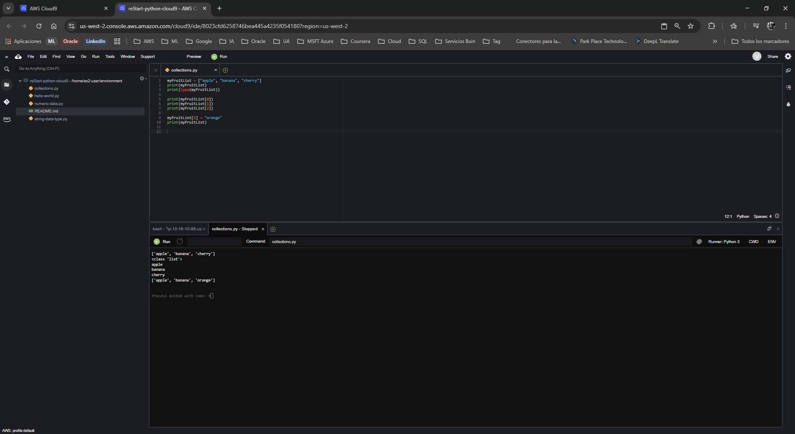
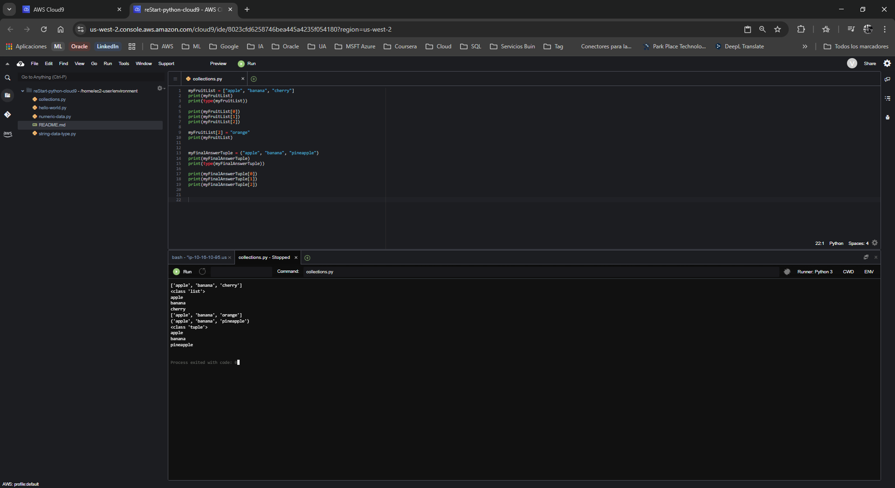
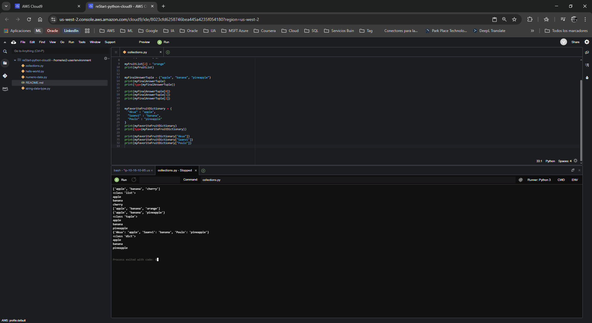

# Laboratorio: Trabajando con Listas, Tuplas y Diccionarios en Python

**Dificultad:** Introductoria

**Tiempo Estimado:** 45 minutos

**Servicios Principales:** AWS Cloud9, AWS Management Console

---

## 🎯 Resumen y Objetivos

En Python, a menudo es necesario agrupar múltiples tipos de datos (como cadenas de texto y números) en colecciones estructuradas. Este laboratorio se centra en las tres estructuras de datos compuestas más utilizadas en Python: la lista (`list`), la tupla (`tuple`) y el diccionario (`dict`). Al finalizar esta práctica, serás capaz de:
* Declarar y manipular listas (colecciones ordenadas y mutables).
* Declarar y acceder a tuplas (colecciones ordenadas e inmutables).
* Declarar y extraer información de diccionarios (colecciones de pares clave-valor).

---

## 🔬 Análisis del Escenario

Como Ingeniero de Soporte Cloud, el diagnóstico de esta solicitud resalta la importancia de dominar las estructuras de datos o colecciones. En el ecosistema de AWS, cuando interactúas con los servicios a través de código (por ejemplo, usando Boto3, el SDK de AWS para Python), las respuestas de las APIs casi siempre se devuelven en formato JSON, el cual se mapea directamente a diccionarios y listas en Python. Comprender cómo iterar, modificar o proteger estos datos (mutabilidad vs. inmutabilidad) es un pilar fundamental para el desarrollo de scripts de automatización robustos y eficientes.

---

## 🛠️ Desarrollo de las Tareas

### Tarea 1: Acceso al IDE de AWS Cloud9

1. **Inicia** tu entorno de laboratorio desde la plataforma (botón **Start Lab**) y espera hasta que el estado indique *Lab status: ready*.
2. **Abre** la Consola de Administración de AWS haciendo clic en el botón **AWS**.
3. **Navega** al servicio **Cloud9** utilizando la barra de búsqueda superior.
4. En el panel de entornos, **localiza** la tarjeta `reStart-python-cloud9` y **haz clic** en **Open IDE**. (Recuerda elegir **Discard** y **No** si aparecen ventanas emergentes sobre configuraciones o contenido de terceros).

### Tarea 2: Crear el archivo de ejercicio de Python

1. En la barra de menú del IDE, **selecciona** **File** > **New From Template** > **Python File**.
2. **Elimina** el código de muestra incluido por defecto.
3. **Selecciona** **File** > **Save As...**.
4. **Asigna** el nombre `collections.py` y **guarda** el archivo en el directorio `/home/ec2-user/environment`.
5. **Abre** una sesión de terminal (ícono **+** > **New Terminal**) y **verifica** tu ruta actual ejecutando `pwd`.

### Tarea 3: Ejercicio 1 - Trabajando con Listas (List)

Las listas se definen mediante corchetes `[]` y sus elementos pueden ser modificados (son mutables).

1. En tu archivo `collections.py`, **escribe** el siguiente código para definir una lista de frutas y mostrar su tipo de dato:
   ```python
   myFruitList = ["apple", "banana", "cherry"]
   print(myFruitList)
   print(type(myFruitList))
   ```
2. Para acceder a los elementos por su posición (índice), **añade** las siguientes líneas:
   ```python
   print(myFruitList[0])
   print(myFruitList[1])
   print(myFruitList[2])
   ```
3. Las listas permiten alterar su contenido. **Modifica** el tercer elemento ("cherry" a "orange") e **imprime** la lista actualizada añadiendo este bloque:
   ```python
   myFruitList[2] = "orange"
   print(myFruitList)
   ```
4. **Guarda** (`Ctrl+S` / `Cmd+S`) y **ejecuta** el script (botón **Run**). Verifica que la consola inferior muestre la lista original, los elementos individuales y la lista modificada.

<p align="center">
  
</p>

### Tarea 4: Ejercicio 2 - Trabajando con Tuplas (Tuple)

Las tuplas se definen mediante paréntesis `()` y, una vez creadas, no pueden ser alteradas (son inmutables).

1. **Añade** un par de líneas en blanco en tu archivo y **define** una tupla escribiendo el siguiente código:
   ```python
   myFinalAnswerTuple = ("apple", "banana", "pineapple")
   print(myFinalAnswerTuple)
   print(type(myFinalAnswerTuple))
   ```
2. Al igual que las listas, accede a sus elementos por índice. **Añade** este bloque:
   ```python
   print(myFinalAnswerTuple[0])
   print(myFinalAnswerTuple[1])
   print(myFinalAnswerTuple[2])
   ```
3. **Guarda** y **ejecuta** el script. Confirma que la consola identifica correctamente la clase `<class 'tuple'>` e imprime sus elementos.

<p align="center">
  
</p>

### Tarea 5: Ejercicio 3 - Trabajando con Diccionarios (Dictionary)

Los diccionarios se definen con llaves `{}` y asocian una clave única a un valor específico, en lugar de utilizar índices numéricos.

1. Al final de tu script, **crea** el siguiente diccionario:
   ```python
   myFavoriteFruitDictionary = {
     "Akua" : "apple",
     "Saanvi" : "banana",
     "Paulo" : "pineapple"
   }
   print(myFavoriteFruitDictionary)
   print(type(myFavoriteFruitDictionary))
   ```
2. Para acceder a los valores usando los nombres (claves) en lugar de números, **añade** las siguientes líneas:
   ```python
   print(myFavoriteFruitDictionary["Akua"])
   print(myFavoriteFruitDictionary["Saanvi"])
   print(myFavoriteFruitDictionary["Paulo"])
   ```
3. **Guarda** el archivo y **ejecuta** el código completo por última vez. Verifica en la consola de salida que se muestre la clase `<class 'dict'>` y se extraigan correctamente las frutas favoritas de cada usuario.

<p align="center">
  
</p>

---

## 💡 Respuestas Analíticas

Al operar con estructuras de datos, es vital comprender la lógica subyacente que el intérprete de Python utiliza:

* **¿Por qué el índice de la lista y la tupla comienza en `0` en lugar de `1`?**
  *Análisis:* Este concepto se llama "Zero-based indexing" (Indexación basada en cero). En lenguajes de programación como Python (y C, en el cual está basado el intérprete CPython), el índice representa el "desplazamiento" o la distancia en la memoria desde el inicio de la colección. El primer elemento tiene una distancia de cero desde el principio, por lo que su posición es `0`.
* **¿Cuál es la ventaja de usar una Tupla sobre una Lista si la Tupla no se puede modificar?**
  *Análisis:* La inmutabilidad otorga dos ventajas principales: seguridad y rendimiento. Al garantizar que los datos no cambiarán accidentalmente durante la ejecución del programa, evitas errores lógicos (bugs) críticos. Además, debido a su estructura estática, las tuplas consumen menos memoria y son ligeramente más rápidas de iterar que las listas.
* **¿Por qué los diccionarios utilizan claves personalizadas (`"Akua"`) en lugar de posiciones numéricas?**
  *Análisis:* Los diccionarios son implementaciones de "Hash Maps" (Tablas Hash). Su diseño está optimizado para recuperar valores a una velocidad constante casi instantánea, independientemente del tamaño del diccionario, basándose en la huella criptográfica de su clave (key). Son esenciales cuando los datos tienen relaciones descriptivas (ej. `Atributo -> Valor`).

---