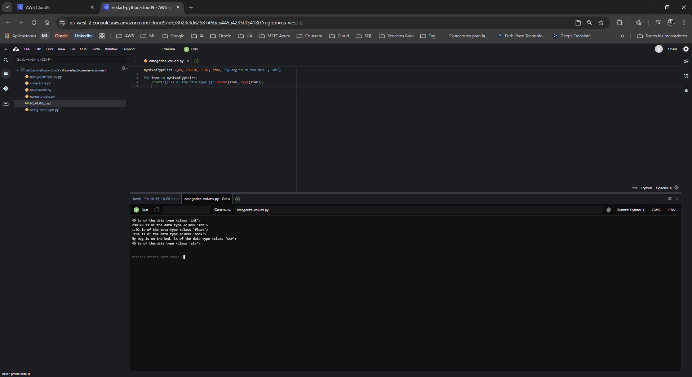

# Laboratorio: Categorización de Valores en Python

**Dificultad:** Introductoria

**Tiempo Estimado:** 30 minutos

**Servicios Principales:** AWS Cloud9, AWS Management Console

---

## 🎯 Resumen y Objetivos

A diferencia de otros lenguajes de programación más rígidos, Python ofrece una gran flexibilidad al permitir combinar diferentes tipos de datos dentro de una misma estructura. En este laboratorio, pondrás en práctica los conocimientos adquiridos en módulos anteriores para crear una colección mixta y automatizar su análisis. Al finalizar esta práctica, serás capaz de:
* Declarar y utilizar una lista que contenga tipos de datos numéricos, cadenas de texto y booleanos simultáneamente.
* Implementar un bucle `for` para recorrer (iterar) colecciones de datos.
* Utilizar la función `print()` combinada con métodos de formateo para extraer y mostrar dinámicamente el tipo de dato subyacente de cada elemento.

---

## 🔬 Análisis del Escenario

Como Ingeniero de Soporte Cloud, el diagnóstico de este requerimiento técnico destaca la necesidad de dominar el control de flujo y el tipado dinámico. En entornos de producción sobre AWS, es muy común recibir cargas de datos (payloads) heterogéneas, como archivos JSON con configuraciones de infraestructura donde conviven identificadores (strings), recuentos de instancias (integers) y estados de activación (booleans). Comprender cómo iterar sobre estas estructuras de datos mixtas utilizando bucles `for` es una habilidad fundamental para cualquier automatización o script de auditoría que desarrolles en la nube.

---

## 🛠️ Desarrollo de las Tareas

### Tarea 1: Acceder al IDE de AWS Cloud9

1. **Inicia** tu entorno de laboratorio desde la plataforma principal (mediante el botón **Start Lab**) y espera a que el estado cambie a *Lab status: ready*.
2. **Haz clic** en el botón **AWS** para abrir la Consola de Administración en una nueva pestaña del navegador.
3. **Navega** hacia el servicio **Cloud9** utilizando la barra de búsqueda superior.
4. En el panel de tus entornos (Your environments), **localiza** el entorno `reStart-python-cloud9` y **selecciona** **Open IDE**. (Recuerda elegir **Discard** y **No** si el entorno te muestra ventanas emergentes de advertencia iniciales).

### Tarea 2: Crear el archivo de ejercicio de Python

1. En la barra de menú superior de Cloud9, **selecciona** **File** > **New From Template** > **Python File**.
2. **Elimina** el código de muestra que aparece de forma predeterminada para partir de un archivo limpio.
3. **Haz clic** en **File** > **Save As...**.
4. **Asigna** el nombre `categorize-values.py` al archivo y **guárdalo** en el directorio predeterminado `/home/ec2-user/environment`.
5. **Abre** una sesión de terminal haciendo clic en el ícono **+** (en la zona de pestañas inferior) y **selecciona** **New Terminal**. 
6. **Ejecuta** el comando `pwd` en la terminal para cerciorarte de que estás en la ruta correcta.

### Tarea 3: Ejercicio 1 - Crear una lista con tipos mixtos

1. En el editor donde tienes abierto tu archivo `categorize-values.py`, **define** una lista que contenga múltiples tipos de datos. **Escribe** la siguiente línea de código:
   ```python
   myMixedTypeList =[45, 290578, 1.02, True, "My dog is on the bed.", "45"]
   ```

### Tarea 4: Implementar un bucle `for` para iterar la lista

1. A continuación de la declaración de tu lista, **implementa** un bucle `for` que recorra cada elemento y evalúe su tipo de dato. **Añade** el siguiente bloque de código respetando estrictamente la indentación (sangría) de Python:
   ```python
   for item in myMixedTypeList:
       print("{} is of the data type {}".format(item, type(item)))
   ```
2. **Guarda** el archivo utilizando el atajo de teclado (`Ctrl+S` o `Cmd+S`), o navegando a **File** > **Save**.
3. **Ejecuta** el script haciendo clic en el botón verde **Run** (Play) ubicado en la barra superior del IDE.
4. **Verifica** el panel inferior (Runner o Terminal) para confirmar que la salida es exactamente la esperada:
   ```text
   45 is of the data type <class 'int'>
   290578 is of the data type <class 'int'>
   1.02 is of the data type <class 'float'>
   True is of the data type <class 'bool'>
   My dog is on the bed. is of the data type <class 'str'>
   45 is of the data type <class 'str'>
   ```

<p align="center">
  
</p>
---

## 💡 Respuestas Analíticas

Para asegurar que los conceptos detrás de este código queden firmemente arraigados en tu aprendizaje técnico, analicemos los comportamientos clave observados:

* **¿Por qué Python permite listas con tipos de datos mixtos, a diferencia de lenguajes como C o Java?**
  *Análisis:* En lenguajes de tipado estático (como C o Java), los arreglos (arrays) requieren que todos sus elementos sean del mismo tipo para asignar bloques de memoria contiguos del mismo tamaño. Python, por el contrario, utiliza tipado dinámico y trata todo como un objeto. Una lista en Python es, bajo el capó (en la implementación CPython), un arreglo de punteros (referencias de memoria). Dado que los punteros tienen el mismo tamaño independientemente del objeto al que apunten, la lista puede almacenar referencias a un `int`, un `float` y un `str` simultáneamente sin problemas de asignación de memoria.
* **¿Cómo funciona exactamente la sintaxis `for item in myMixedTypeList:`?**
  *Análisis:* A diferencia de los bucles `for` tradicionales basados en contadores e índices (ej. `for(int i=0; i<length; i++)`), el bucle `for` de Python actúa como un iterador (equivalente a un `foreach` en otros lenguajes). Le pide automáticamente a la lista el siguiente elemento en cada ciclo, lo asigna temporalmente a la variable declarada `item` y ejecuta el bloque de código indentado. Cuando no quedan más elementos, el bucle finaliza limpiamente.
* **¿Por qué el último "45" se evalúa como `str` y no como `int`?**
  *Análisis:* Aunque el contenido visual sea numérico, la presencia de las comillas dobles (`"45"`) le indica explícitamente al intérprete que trate ese valor como una cadena de caracteres alfanuméricos, forzándolo a instanciar un objeto de la clase `<class 'str'>`.
---