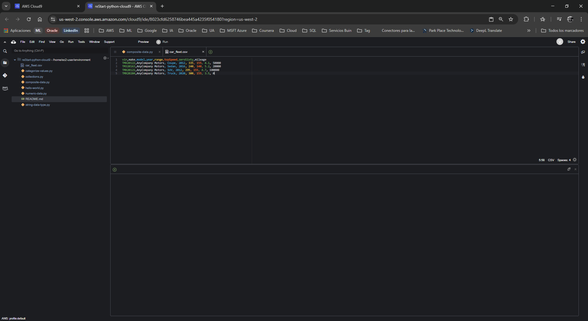
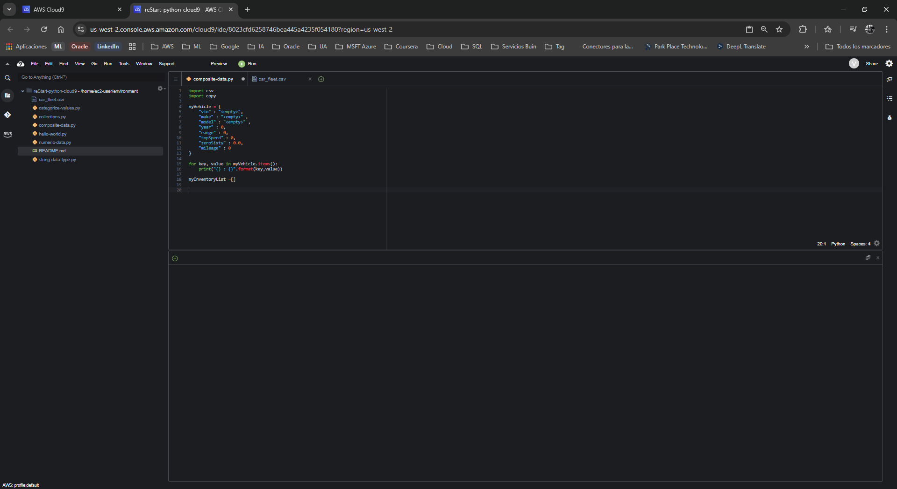
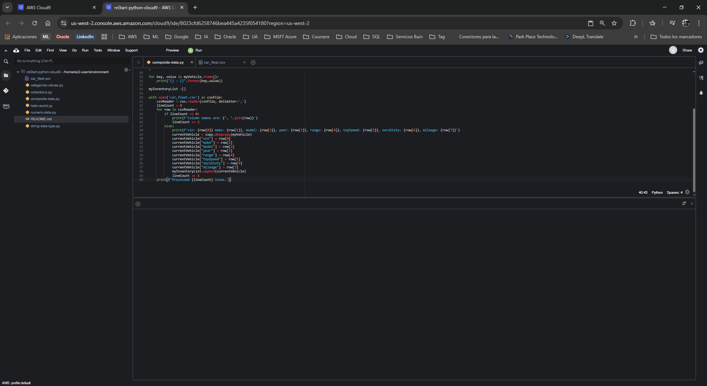
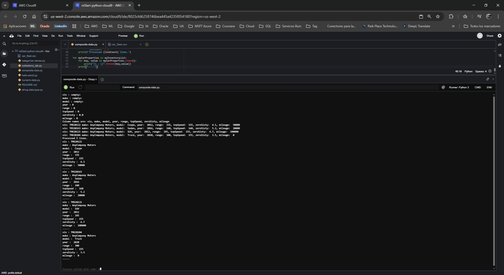

# Laboratorio: Trabajando con Tipos de Datos Compuestos en Python

**Dificultad:** Intermedia  
**Tiempo Estimado:** 45 minutos  
**Servicios Principales:** AWS Cloud9, AWS Management Console  

---

## 🎯 Resumen y Objetivos

Un tipo de dato compuesto es aquel que se construye agrupando múltiples tipos de datos primitivos o colecciones. Puedes visualizarlo como capas de información anidada (por ejemplo, una cadena de texto dentro de un diccionario, que a su vez está dentro de una lista). En este laboratorio, procesarás un archivo de texto plano y lo convertirás en una estructura de datos compleja en la memoria del sistema. Al finalizar esta práctica, serás capaz de:
* Importar y utilizar módulos estándar de Python (`csv`, `copy`).
* Leer y procesar archivos externos en formato CSV (Valores Separados por Comas).
* Implementar el método `copy.deepcopy()` para evitar la sobreescritura de referencias en memoria.
* Iterar sobre colecciones anidadas (listas de diccionarios) utilizando bucles `for` anidados.

---

## 🔬 Análisis del Escenario

Como Ingeniero de Soporte Cloud, con frecuencia te enfrentarás a la tarea de auditar inventarios de infraestructura (como flotas de instancias EC2 o bases de datos) exportados por otros sistemas en formatos tabulares como CSV. Este ejercicio simula la ingesta de esos reportes de inventario. El diagnóstico técnico de esta práctica resalta un concepto vital: la gestión de memoria RAM. Si al leer un archivo iteras sobre una misma variable sin hacer una "copia profunda" (`deepcopy`), todas las filas de tu lista terminarán apuntando al último registro procesado, generando reportes corruptos. Dominar este comportamiento evitará vulnerabilidades críticas en tus futuros scripts de automatización.

---

## 🛠️ Desarrollo de las Tareas

### Tarea 1: Acceso al IDE de AWS Cloud9

1. **Inicia** tu entorno de laboratorio desde la plataforma principal (botón **Start Lab**) y espera a que el estado cambie a *Lab status: ready*.
2. **Abre** la Consola de Administración de AWS haciendo clic en el botón **AWS**.
3. **Navega** al servicio **Cloud9** desde la barra de búsqueda superior.
4. En el panel de entornos, **localiza** la tarjeta `reStart-python-cloud9` y **haz clic** en **Open IDE**. (Descarta cualquier alerta sobre `.c9/project.settings` o contenido de terceros).

### Tarea 2: Crear los archivos del ejercicio

En esta práctica necesitarás dos archivos: el script de Python y un archivo de datos (CSV).

1. En la barra de menú superior de Cloud9, **navega** a **File** > **New From Template** > **Python File**.
2. **Elimina** el código de muestra, **selecciona** **File** > **Save As...**, **nombra** el archivo como `composite-data.py` y **guárdalo** en el directorio `/home/ec2-user/environment`.
3. Ahora, **crea** el archivo de datos navegando a **File** > **New File**.
4. **Selecciona** **File** > **Save As...** y **nombra** este nuevo archivo como `car_fleet.csv`.
5. **Copia y pega** el siguiente bloque de texto tabular exactamente como se muestra a continuación dentro de `car_fleet.csv` y **guarda** el archivo (`Ctrl+S` o `Cmd+S`):
   ```text
   vin,make,model,year,range,topSpeed,zeroSixty,mileage
   TMX20122,AnyCompany Motors, Coupe, 2012, 335, 155, 4.1, 50000
   TM320163,AnyCompany Motors, Sedan, 2016, 240, 140, 5.2, 20000
   TMX20121,AnyCompany Motors, SUV, 2012, 295, 155, 4.7, 100000
   TMX20204,AnyCompany Motors, Truck, 2020, 300, 155, 3.5, 0
   ```
   *(Nota de soporte: Si Cloud9 bloquea el portapapeles con el mensaje "Native Clipboard Unavailable", usa los atajos de teclado de tu sistema operativo).*

<p align="center">
  
</p>

### Tarea 3: Importar módulos y definir la estructura base

1. **Abre** tu script `composite-data.py` en el editor.
2. **Escribe** el siguiente código para importar los módulos necesarios, definir un diccionario base (molde) y una lista vacía para almacenar el inventario:
   ```python
   import csv
   import copy

   myVehicle = {
       "vin" : "<empty>",
       "make" : "<empty>" ,
       "model" : "<empty>" ,
       "year" : 0,
       "range" : 0,
       "topSpeed" : 0,
       "zeroSixty" : 0.0,
       "mileage" : 0
   }

   for key, value in myVehicle.items():
       print("{} : {}".format(key,value))

   myInventoryList =[]
   ```
3. **Guarda** los cambios.

<p align="center">
  
</p>

### Tarea 4: Copiar el CSV a la memoria (RAM)

Vas a usar el administrador de contexto `with open` para leer el archivo CSV y procesarlo fila por fila.

1. Al final de tu archivo `composite-data.py`, **añade** el siguiente bloque de código. **Presta estricta atención a la indentación**:
   ```python
   with open('car_fleet.csv') as csvFile:
       csvReader = csv.reader(csvFile, delimiter=',')  
       lineCount = 0  
       for row in csvReader:
           if lineCount == 0:
               print(f'Column names are: {", ".join(row)}')  
               lineCount += 1  
           else:  
               print(f'vin: {row[0]} make: {row[1]}, model: {row[2]}, year: {row[3]}, range: {row[4]}, topSpeed: {row[5]}, zeroSixty: {row[6]}, mileage: {row[7]}')  
               currentVehicle = copy.deepcopy(myVehicle)  
               currentVehicle["vin"] = row[0]  
               currentVehicle["make"] = row[1]  
               currentVehicle["model"] = row[2]  
               currentVehicle["year"] = row[3]  
               currentVehicle["range"] = row[4]  
               currentVehicle["topSpeed"] = row[5]  
               currentVehicle["zeroSixty"] = row[6]  
               currentVehicle["mileage"] = row[7]  
               myInventoryList.append(currentVehicle)  
               lineCount += 1  
       print(f'Processed {lineCount} lines.')
   ```
2. **Guarda** el archivo.

<p align="center">
  
</p>

### Tarea 5: Imprimir el inventario de vehículos

Para confirmar que la estructura de datos anidada se creó correctamente, recorrerás la lista general y, dentro de ella, cada diccionario individual.

1. Al final del script, **añade** este doble bucle `for`:
   ```python
   for myCarProperties in myInventoryList:
       for key, value in myCarProperties.items():
           print("{} : {}".format(key,value))
       print("-----")
   ```
2. **Guarda** el archivo definitivamente.
3. **Ejecuta** el script (botón **Run**). 
4. **Inspecciona** la consola inferior. Debes ver primero el diccionario vacío, luego las filas crudas procesadas desde el CSV, y finalmente la estructura completa de inventario separada por la línea `-----`.

<p align="center">
  
</p>

---

## 💡 Respuestas Analíticas

Para afianzar tu criterio como especialista técnico, vamos a profundizar en las mecánicas detrás de este código:

* **¿Por qué fue absolutamente necesario usar `copy.deepcopy(myVehicle)` en lugar de `currentVehicle = myVehicle`?**
  *Análisis:* Este es uno de los errores (bugs) más comunes en Python. Si utilizas una "copia superficial" (shallow copy) o una asignación directa (`=`), no estás creando un nuevo diccionario, sino referenciando (apuntando a) la misma dirección de memoria del diccionario original. Como resultado, en cada iteración estarías sobreescribiendo el mismo objeto, y al final, tu `myInventoryList` tendría 4 referencias idénticas al último vehículo del CSV (`TMX20204`). La función `deepcopy` reserva un bloque completamente nuevo en la RAM (Crea una "caja de almacenamiento" nueva e independiente) en cada ciclo.
* **¿Qué función cumple la declaración `with open(...)`?**
  *Análisis:* Es un "Gestor de Contexto" (Context Manager). Cuando trabajas con I/O (Entrada/Salida) leyendo archivos del disco duro, debes liberar el recurso de memoria cerrando el archivo (`file.close()`) cuando terminas. La sintaxis `with` garantiza automáticamente que el archivo se cierre de forma segura una vez que el bloque de código identado finaliza, incluso si ocurre una excepción (error) a mitad del proceso. Esto previene fugas de memoria (memory leaks).
* **¿Qué es la sintaxis `f'...'` que usamos dentro del bloque `with`?**
  *Análisis:* Son "F-Strings" (Cadenas con formato literal), introducidas en Python 3.6. A diferencia de `.format()`, las f-strings te permiten incrustar directamente variables y expresiones de Python dentro de las llaves `{}` de la cadena. Es la forma más moderna, legible y eficiente (a nivel de rendimiento) de formatear texto en Python.

---