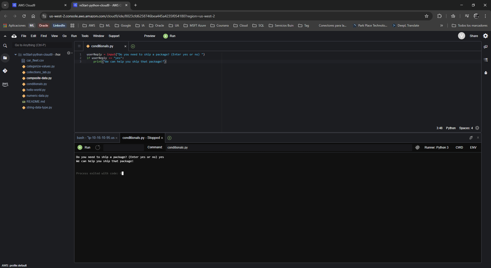
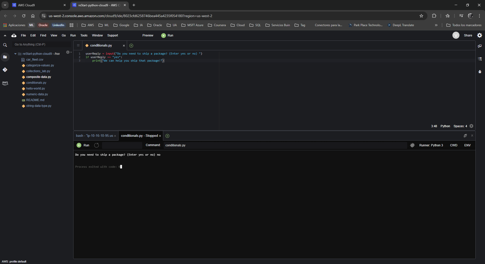
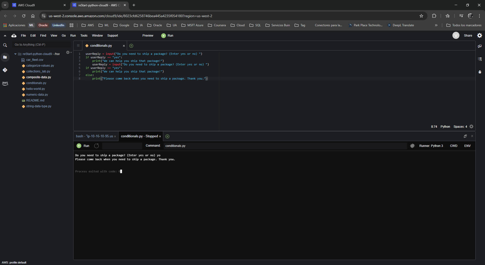
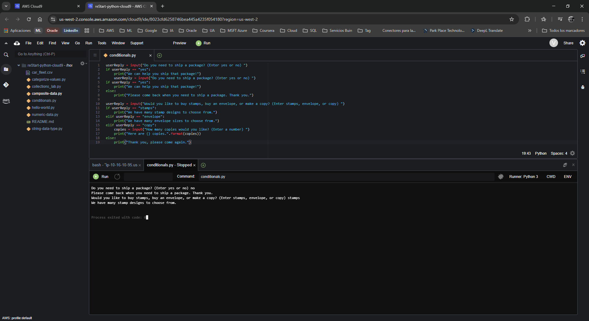
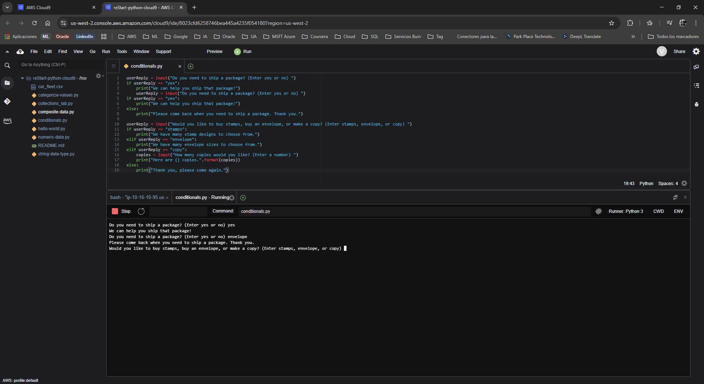
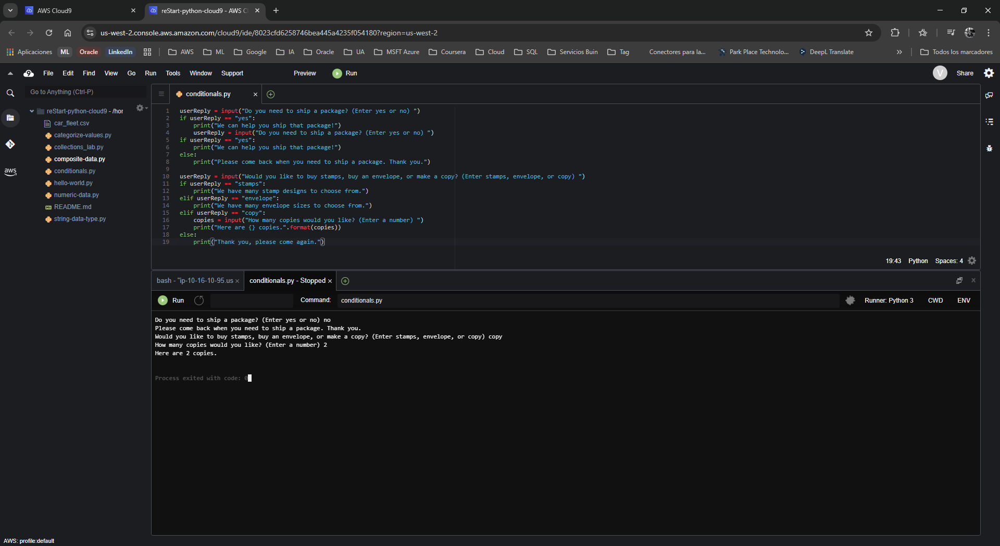
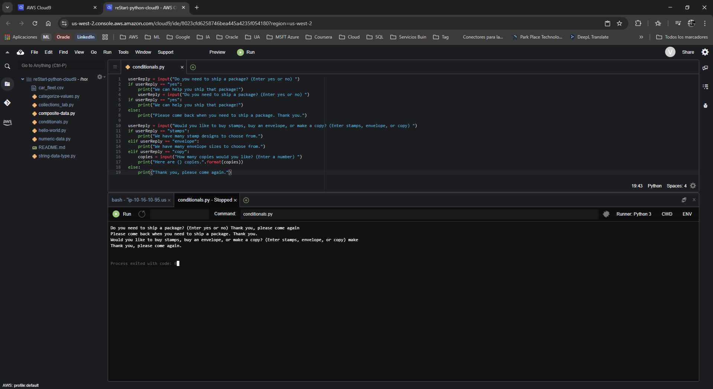

# Laboratorio: Trabajando con Condicionales en Python

**Dificultad:** Introductoria

**Tiempo Estimado:** 45 minutos

**Servicios Principales:** AWS Cloud9, AWS Management Console

---

## 🎯 Resumen y Objetivos

En programación, una sección de código que evalúa información y toma decisiones basándose en ella se denomina declaración condicional (conditional statement). Los condicionales permiten crear múltiples rutas o flujos de ejecución dentro de un mismo programa. En este laboratorio, escribirás un script interactivo que reacciona de forma diferente según la entrada del usuario. Al finalizar esta práctica, serás capaz de:
* Implementar la declaración `if` para ejecutar código cuando se cumple una condición.
* Implementar la declaración `else` para capturar cualquier caso que no cumpla la condición principal.
* Implementar la declaración `elif` (else-if) para evaluar múltiples condiciones específicas de forma secuencial.

---

## 🔬 Análisis del Escenario

Como Ingeniero de Soporte Cloud, el diagnóstico de este laboratorio se centra en el **Control de Flujo**. En la automatización de infraestructura de AWS, los scripts rara vez se ejecutan de forma lineal y estática. Por ejemplo, al auditar instancias EC2, tu código debe decidir: *Si (if)* la instancia está detenida, enciéndela; *si no (else)*, genera un reporte. Comprender cómo Python utiliza los operadores de comparación y la indentación para ramificar la lógica es un requisito crítico para construir arquitecturas de respuesta automática y funciones Lambda eficientes.

---

## 🛠️ Desarrollo de las Tareas

### Tarea 1: Acceso al IDE de AWS Cloud9

1. **Inicia** tu entorno de laboratorio desde la plataforma principal (mediante el botón **Start Lab**) y espera a que el estado cambie a *Lab status: ready*.
2. **Haz clic** en el botón **AWS** para abrir la Consola de Administración en una nueva pestaña del navegador.
3. **Navega** hacia el servicio **Cloud9** utilizando la barra de búsqueda superior.
4. En el panel de entornos (Your environments), **localiza** la tarjeta `reStart-python-cloud9` y **selecciona** **Open IDE**. (Descarta cualquier alerta sobre configuraciones o contenido de terceros seleccionando **Discard** y **No**).

### Tarea 2: Crear el archivo de ejercicio de Python

1. En la barra de menú superior, **navega** a **File** > **New From Template** > **Python File**.
2. **Elimina** el código de muestra proporcionado en la plantilla.
3. **Selecciona** **File** > **Save As...**.
4. **Asigna** el nombre `conditionals.py` y **guarda** el archivo en el directorio `/home/ec2-user/environment`.
5. **Abre** una sesión de terminal (ícono **+** en la zona inferior > **New Terminal**) y **ejecuta** el comando `pwd` para verificar que estás en la ruta correcta.

### Tarea 3: Ejercicio 1 - Trabajando con la declaración `if`

Escribirás un script que simula el mostrador de envíos de una oficina postal.

1. En tu archivo `conditionals.py`, **escribe** el siguiente código para solicitar información al usuario y evaluar su respuesta. **Presta mucha atención a la indentación** (la sangría) en la segunda línea:
   ```python
   userReply = input("Do you need to ship a package? (Enter yes or no) ")
   if userReply == "yes":
       print("We can help you ship that package!")
   ```
2. **Guarda** y **ejecuta** el archivo (botón **Run**).
3. Cuando la consola te pregunte, **escribe** `yes` y presiona ENTER. Confirma que el sistema imprime la respuesta de ayuda.
4. **Ejecuta** el archivo nuevamente, **escribe** `no` y presiona ENTER. Confirma que el programa finaliza silenciosamente sin imprimir nada.

<p align="center">
  
</p>

### Tarea 4: Ejercicio 2 - Trabajando con la declaración `else`

Para mejorar la experiencia del usuario, agregarás una respuesta predeterminada en caso de que la respuesta no sea afirmativa.

1. **Añade** la declaración `else` justo debajo del bloque `if`. Asegúrate de que la palabra `else:` esté alineada con `if` (sin indentación), pero que la instrucción `print` interior sí tenga indentación:
   ```python
   userReply = input("Do you need to ship a package? (Enter yes or no) ")
   if userReply == "yes":
       print("We can help you ship that package!")
   else:
       print("Please come back when you need to ship a package. Thank you.")
   ```
2. **Guarda** y **ejecuta** el archivo.
3. **Prueba** introduciendo `no` (o cualquier otra palabra que no sea "yes"). Confirma que el script ahora procesa la ruta alternativa e imprime el mensaje de agradecimiento.

<p align="center">
  
</p>

<p align="center">
  
</p>

### Tarea 5: Ejercicio 3 - Trabajando con la declaración `elif`

Ahora, ampliarás el script ofreciendo servicios adicionales mediante múltiples condiciones exclusivas.

1. Al final de tu archivo `conditionals.py`, **añade** el siguiente bloque de código:
   ```python
   userReply = input("Would you like to buy stamps, buy an envelope, or make a copy? (Enter stamps, envelope, or copy) ")
   if userReply == "stamps":
       print("We have many stamp designs to choose from.")
   elif userReply == "envelope":
       print("We have many envelope sizes to choose from.")
   elif userReply == "copy":
       copies = input("How many copies would you like? (Enter a number) ")
       print("Here are {} copies.".format(copies))
   else:
       print("Thank you, please come again.")
   ```
2. **Guarda** el archivo definitivamente.
3. **Ejecuta** el programa múltiples veces para probar todas las rutas lógicas:
   * **Prueba 1:** A la primera pregunta responde `no` y a la segunda `stamps`.

<p align="center">
  
</p>

   * **Prueba 2:** A la primera pregunta responde `yes` y a la segunda `envelope`.

<p align="center">
  
</p>

   * **Prueba 3:** A la primera pregunta responde `no`, y a la segunda `copy`. Observa cómo el sistema ingresa a un bloque condicional que exige otro *input*. Ingresa un número (ej. `2`) y verifica la salida formateada.

<p align="center">
  
</p>

   * **Prueba 4:** Responde algo no listado en la segunda pregunta para forzar que el programa caiga en el bloque `else` final ("Thank you, please come again.").

<p align="center">
  
</p>

---

## 💡 Respuestas Analíticas

Al operar con condicionales, es indispensable comprender las decisiones de diseño del lenguaje Python:

* **¿Por qué Python usa espacios (indentación) en lugar de llaves `{}` para los bloques lógicos?**
  *Análisis:* A diferencia de lenguajes como C++, Java o JavaScript, Python impone la indentación estricta (usualmente 4 espacios o un tabulador) como una regla sintáctica, no solo de estilo. Esto fuerza a los desarrolladores a escribir código altamente legible y estructurado. Si omites la indentación después de un `if:`, el intérprete arrojará un `IndentationError`.
* **¿Qué diferencia hay entre `=` y `==`?**
  *Análisis:* El símbolo único `=` es el **Operador de Asignación** (guarda un valor en una variable, ej. `x = 5`). El doble símbolo `==` es el **Operador de Comparación** (evalúa si el lado izquierdo es idéntico al lado derecho y devuelve un Booleano `True` o `False`). Usar `=` en una declaración `if` causará un error de sintaxis en Python.
* **¿Por qué el programa no revisa los otros `elif` después de encontrar una condición verdadera?**
  *Análisis:* Las estructuras `if-elif-else` son mutuamente excluyentes y operan bajo un principio llamado *Short-Circuit Evaluation* (Evaluación de cortocircuito). Una vez que el intérprete encuentra una condición que se evalúa como `True`, ejecuta ese bloque y salta automáticamente hasta el final de toda la estructura condicional. Esto ahorra ciclos de CPU y memoria, optimizando el rendimiento del script.

---