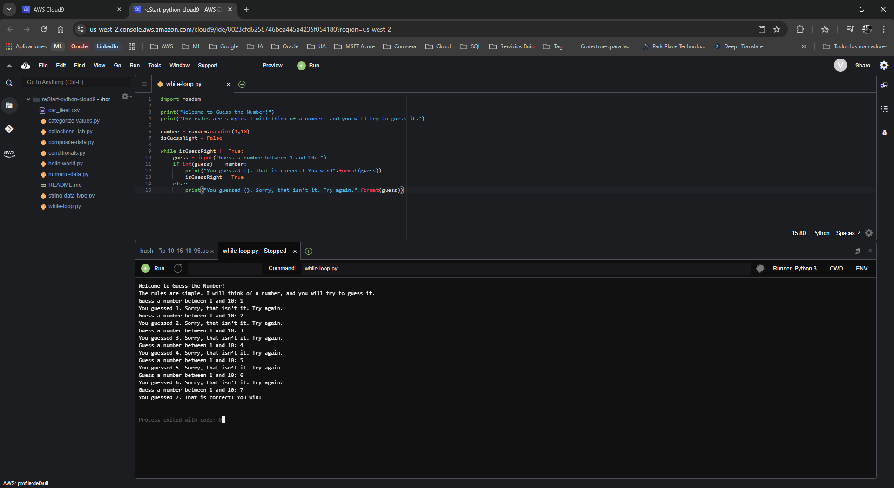
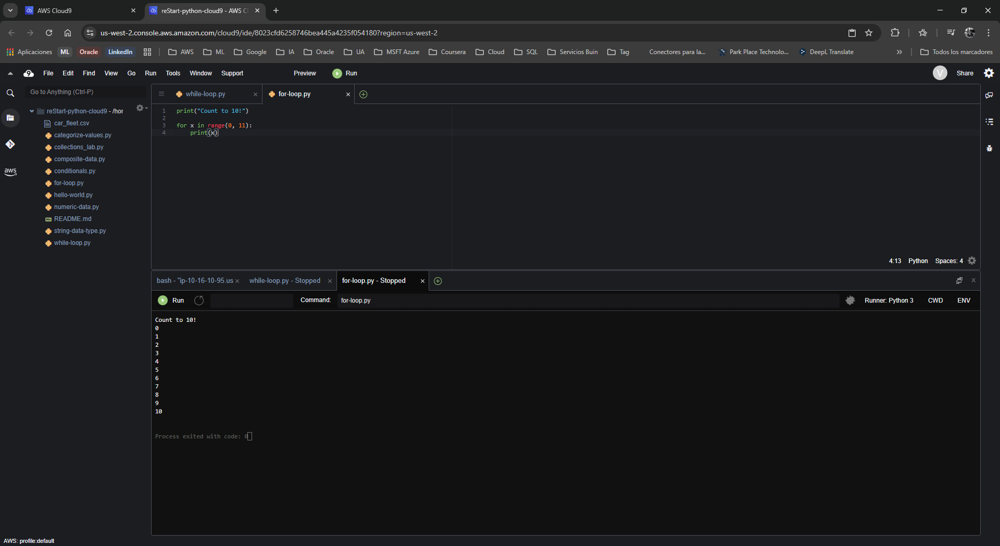

# Laboratorio: Trabajando con Bucles (Loops) en Python

**Dificultad:** Introductoria  
**Tiempo Estimado:** 45 minutos  
**Servicios Principales:** AWS Cloud9, AWS Management Console  

---

## 🎯 Resumen y Objetivos

Un bucle (loop) es un segmento de código estructurado para repetirse múltiples veces basándose en ciertas condiciones o iterando sobre una colección de datos. En este laboratorio, explorarás las dos estructuras de repetición fundamentales en Python: el bucle `while` y el bucle `for`. Al finalizar esta práctica, serás capaz de:
* Importar y utilizar librerías estándar como `random`.
* Implementar un bucle `while` para repetir un bloque de código hasta que se cumpla una condición específica.
* Implementar un bucle `for` utilizando la función `range()` para ejecutar código un número predeterminado de veces.
* Redactar pseudocódigo y documentar tus scripts utilizando comentarios (`#`).

---

## 🔬 Análisis del Escenario

Como Ingeniero de Soporte Cloud, el uso de bucles es el núcleo de la automatización. En AWS, constantemente tendrás que evaluar estados. Por ejemplo, al lanzar una base de datos RDS, tu script puede utilizar un bucle `while` para "esperar" (hacer *polling*) hasta que el estado del recurso cambie de *Creating* a *Available*. Por otro lado, utilizarás bucles `for` sistemáticamente para iterar sobre listas (ej. aplicar un parche de seguridad a un listado de 50 instancias EC2). Comprender cuándo utilizar un bucle condicional (`while`) frente a un bucle de iteración definida (`for`) es esencial para crear scripts robustos que no caigan en bucles infinitos.

---

## 🛠️ Desarrollo de las Tareas

### Tarea 1: Acceder al IDE de AWS Cloud9

1. **Inicia** el entorno de laboratorio desde tu plataforma y espera a que el estado cambie a *Lab status: ready*.
2. **Abre** la Consola de Administración haciendo clic en el botón **AWS**.
3. **Navega** hacia el servicio **Cloud9** mediante la barra de búsqueda superior.
4. En el panel de entornos, **localiza** la tarjeta `reStart-python-cloud9` y **haz clic** en **Open IDE**. (Descarta las advertencias de `.c9` o contenido de terceros).

### Tarea 2: Ejercicio 1 - Creación del juego "Adivina el Número" (`while` loop)

El bucle `while` evalúa una condición booleana. Mientras la condición sea verdadera, el código se repite.

1. **Navega** a **File** > **New From Template** > **Python File** en el menú superior.
2. **Elimina** el código de muestra.
3. **Guarda** el archivo (**File** > **Save As...**) con el nombre `while-loop.py` en tu directorio `/home/ec2-user/environment`.
4. **Escribe** el siguiente código para importar el módulo necesario, definir las reglas del juego y generar un número aleatorio entre 1 y 10:
   ```python
   import random

   print("Welcome to Guess the Number!")
   print("The rules are simple. I will think of a number, and you will try to guess it.")
   
   number = random.randint(1,10)
   isGuessRight = False
   ```
5. A continuación, **añade** la lógica del bucle `while`. **Asegúrate de respetar la indentación**:
   ```python
   while isGuessRight != True:
       guess = input("Guess a number between 1 and 10: ")
       if int(guess) == number:
           print("You guessed {}. That is correct! You win!".format(guess))
           isGuessRight = True
       else:
           print("You guessed {}. Sorry, that isn’t it. Try again.".format(guess))
   ```
   > *Nota de soporte:* Es altamente recomendable añadir comentarios a tu código usando el símbolo `#` para explicar la lógica paso a paso (pseudocódigo), como `# Si el usuario adivina el número, finaliza el bucle`.
6. **Guarda** el archivo (`Ctrl+S` / `Cmd+S`).
7. **Ejecuta** el script presionando el botón **Run**.
8. **Interactúa** con la consola inferior intentando adivinar el número. Observa cómo el programa te sigue preguntando repetidamente hasta que aciertas, momento en el cual la variable `isGuessRight` cambia a `True` y el bucle finaliza.

<p align="center">
  
</p>

### Tarea 3: Ejercicio 2 - Contando números (`for` loop)

El bucle `for` en Python se utiliza a menudo para recorrer una secuencia predefinida.

1. **Crea** un nuevo archivo navegando a **File** > **New From Template** > **Python File**.
2. **Elimina** el código por defecto, **selecciona** **Save As...** y **guárdalo** con el nombre `for-loop.py`.
3. **Escribe** el siguiente bloque de código para contar del 1 al 10 utilizando la función `range()`:
   ```python
   print("Count to 10!")
   
   for x in range(0, 11):
       print(x)
   ```
4. **Guarda** el archivo.
5. **Ejecuta** el script (botón **Run**).
6. **Confirma** en la terminal inferior que el programa imprime en pantalla los números secuencialmente, comenzando desde el 0 y deteniéndose exactamente en el 10.

<p align="center">
  
</p>
---

## 💡 Respuestas Analíticas

Al analizar la sintaxis de estos dos bucles, existen comportamientos fundamentales de Python que debes asimilar:

* **¿Por qué fue necesario escribir `int(guess) == number` en el bucle `while` en lugar de solo `guess == number`?**
  *Análisis:* La función `input()` en Python **siempre** captura la entrada del usuario como una cadena de texto (`str`). Por su parte, la función `random.randint()` genera un número entero puro (`int`). Si comparas un texto `"5"` con un número `5` usando `==`, Python evaluará que son diferentes y te dirá que fallaste. Es obligatorio hacer un "Type Casting" usando `int(guess)` para convertir temporalmente la cadena de texto en un número entero y poder realizar una evaluación matemática real.
* **En el bucle `for`, si la instrucción es contar hasta 10, ¿por qué el rango es `range(0, 11)`?**
  *Análisis:* La función `range(start, stop)` de Python tiene una particularidad de diseño (común en lenguajes derivados de C): el valor de inicio (`start`) es inclusivo, pero el valor final (`stop`) es **exclusivo**. Esto significa que el iterador generará números hasta llegar al valor inmediatamente anterior al `stop`. Para incluir el número 10 en la salida final, el límite superior debe declararse obligatoriamente como 11.
* **¿Qué función cumplen el Pseudocódigo y los Comentarios?**
  *Análisis:* El pseudocódigo es lenguaje humano estructurado como código. Se utiliza antes de programar para mapear la lógica de negocio sin preocuparse por la sintaxis estricta de Python. Los comentarios (`#`) son ignorados por el intérprete al ejecutarse, pero son vitales en ingeniería de software para documentar *por qué* se escribió un bloque de código, facilitando el mantenimiento a futuros desarrolladores (o a ti mismo meses después).

---