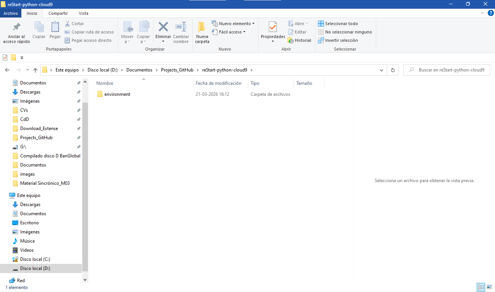
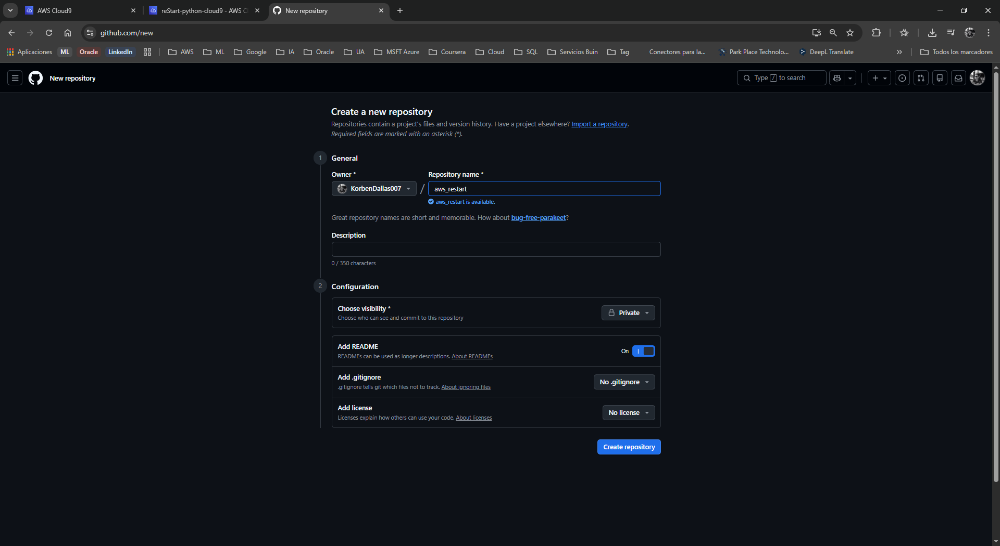
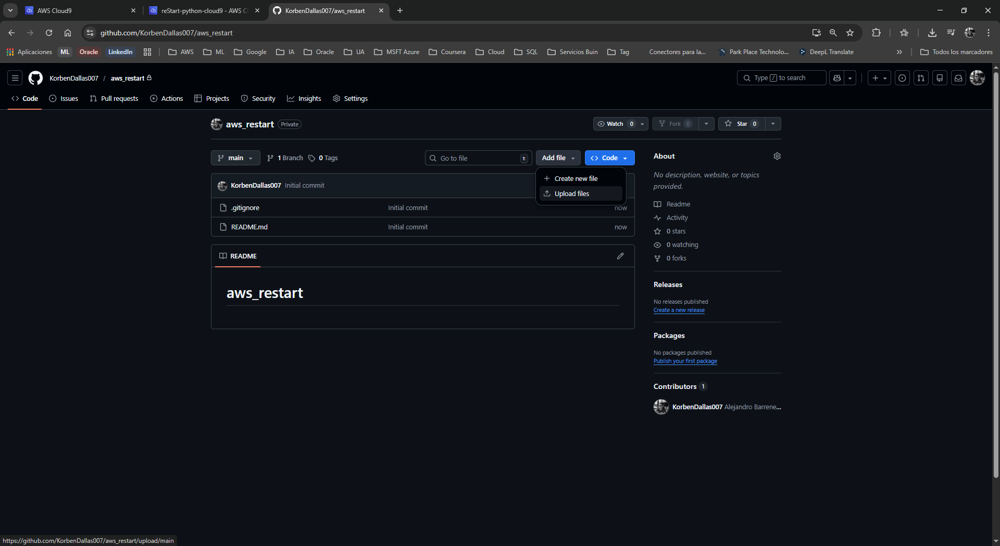
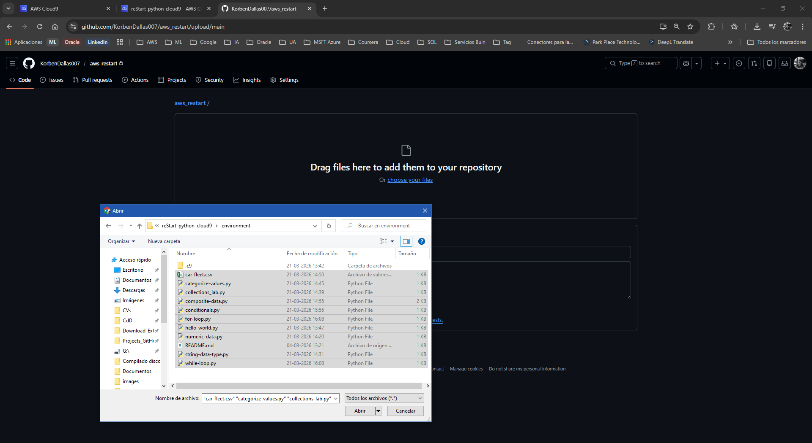
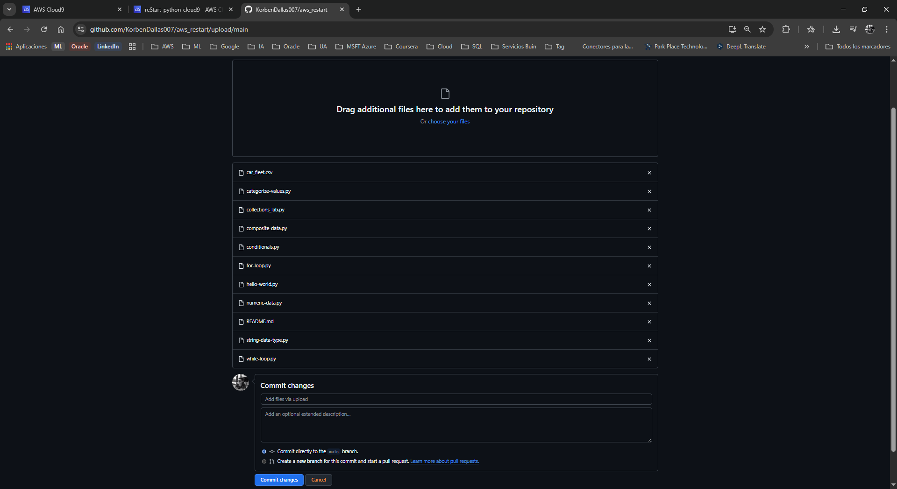
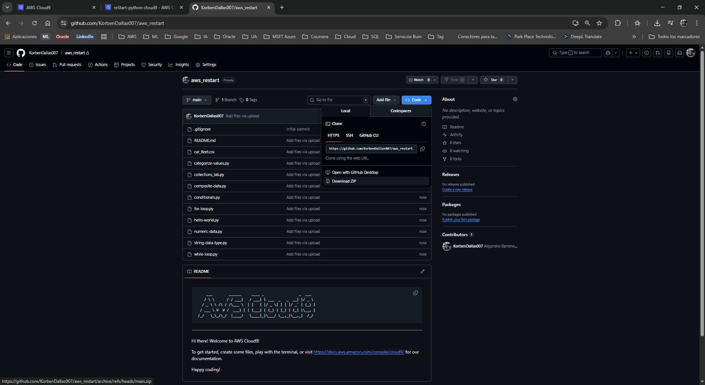
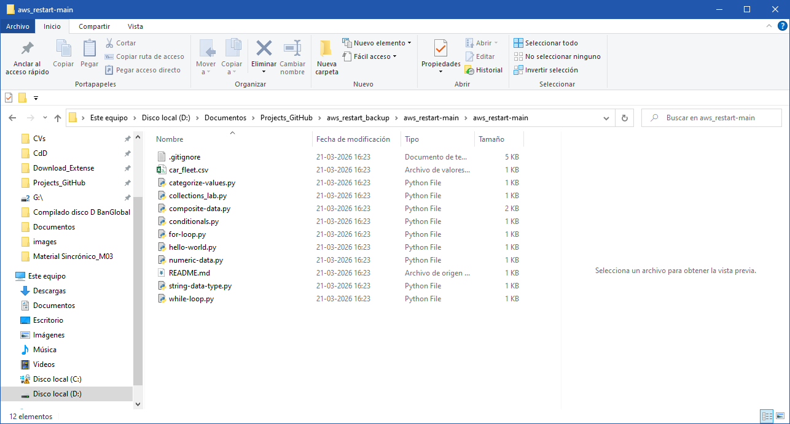

# Laboratorio: Creación de un Repositorio en Git (GitHub)

**Dificultad:** Introductoria

**Tiempo Estimado:** 45 minutos

**Servicios Principales:** AWS Cloud9, GitHub

---

## 🎯 Resumen y Objetivos

El control de versiones es una herramienta imprescindible en el desarrollo de software y la administración de infraestructura en la nube. GitHub es una plataforma de alojamiento remoto que ejecuta instancias de **Git**, el sistema de control de versiones líder en la industria. En este laboratorio, realizarás una copia de seguridad de todo el código creado en laboratorios anteriores y lo migrarás a un repositorio seguro. Al finalizar esta práctica, serás capaz de:
* Exportar tu entorno de trabajo completo desde AWS Cloud9 hacia tu equipo local.
* Crear y configurar un repositorio privado en la plataforma GitHub.
* Inicializar un repositorio con un archivo de documentación (README).
* Subir archivos locales a un repositorio remoto a través de la interfaz web.
* Descargar (clonar en formato comprimido) un repositorio desde GitHub.

---

## 🔬 Análisis del Escenario

Como Ingeniero de Soporte Cloud, el diagnóstico de esta actividad subraya la importancia de las prácticas de DevOps y la protección de datos. Mantener tu código exclusivamente en el almacenamiento local de una instancia temporal de AWS Cloud9 (basada en EC2) representa un riesgo crítico de pérdida de información. Migrar los scripts de Python a un repositorio remoto en GitHub no solo funciona como un respaldo estructurado (Backup), sino que sienta las bases para futuras integraciones de CI/CD (Integración y Despliegue Continuos) y facilita la colaboración técnica con otros ingenieros.

---

## 🛠️ Desarrollo de las Tareas

### Tarea 1: Acceso al IDE de AWS Cloud9

1. **Inicia** tu entorno de laboratorio desde el portal principal (botón **Start Lab**) y espera a que el estado cambie a *Lab status: ready*.
2. **Haz clic** en el botón **AWS** para abrir la Consola de Administración en una nueva pestaña del navegador.
3. **Navega** hacia el servicio **Cloud9** utilizando la barra de búsqueda superior.
4. En el panel de entornos (Your environments), **localiza** la tarjeta `reStart-python-cloud9` y **selecciona** **Open IDE**. (Descarta cualquier ventana emergente de advertencia sobre configuraciones de disco o contenido de terceros).

### Tarea 2: Ejercicio 1 - Descargar tus archivos de Python previos

Vas a exportar todos los scripts de los laboratorios pasados directamente a tu máquina local.

1. En la barra de menú superior de Cloud9, **navega** a **File** > **Download Project**.
2. **Espera** a que el navegador descargue un archivo comprimido (`.zip` o `.tar.gz`) que contiene todo tu espacio de trabajo.
3. En tu computadora local, **localiza** el archivo descargado y **extrae** (descomprime) sus contenidos en una carpeta temporal y de fácil acceso.

  

### Tarea 3: Ejercicio 2 y 3 - Creación de cuenta en GitHub y revisión de guías

1. Abre una nueva pestaña en tu navegador web y **visita** [https://github.com](https://github.com).
2. Si aún no tienes una cuenta, **haz clic** en **Sign up** (Registrarse) en la esquina superior derecha y **sigue** los pasos en pantalla para crear una cuenta gratuita individual.
3. Una vez iniciada la sesión, te sugerimos explorar la documentación oficial sobre repositorios y fundamentos de GitHub en [docs.github.com](https://docs.github.com/es/get-started/start-your-journey/hello-world) (la versión moderna y actualizada de la antigua guía "Hello World").

### Tarea 4: Ejercicio 4 - Crear un repositorio privado

Ahora crearás el "contenedor" remoto para tus scripts.

1. En la página principal de tu sesión de GitHub, **haz clic** en el botón verde **New** (Nuevo) ubicado en el panel izquierdo, o usa el ícono **+** en la esquina superior derecha y selecciona **New repository**.
2. En el campo *Repository name*, **escribe** `aws_restart`.
3. En la sección de visibilidad, **selecciona** la opción **Private** (Privado) para que solo tú tengas acceso al código.
4. En la sección *Initialize this repository with*, **marca** la casilla **Add a README file** (Añadir un archivo README).
5. **Haz clic** en el botón verde inferior **Create repository**.
   *(El sistema te redirigirá a la vista principal de tu nuevo repositorio, mostrando únicamente el archivo `README.md`).*

  

### Tarea 5: Subir tus archivos locales a GitHub

1. En la vista principal de tu repositorio `aws_restart`, **haz clic** en el botón **Add file** y **selecciona** **Upload files** en el menú desplegable.

  

2. La interfaz cambiará a una zona de carga ("Drag and drop"). **Arrastra y suelta** todos los archivos de Python (`.py`) y archivos de datos (como `car_fleet.csv`) que extrajiste en la Tarea 2.

  

3. Espera a que la barra de progreso de cada archivo finalice.
4. En la parte inferior, en la sección *Commit changes*, puedes dejar el mensaje por defecto (ej. "Add files via upload") y **haz clic** en el botón verde **Commit changes**.
   *(Tus archivos ahora están respaldados de forma segura en la nube).*

  

### Tarea 6: Ejercicio 5 - Descargar un repositorio desde la interfaz web

Como prueba de recuperación de datos, simularás la descarga de tu repositorio en un entorno o máquina nueva.

1. Asegúrate de estar en la vista principal de tu repositorio en GitHub.
2. **Haz clic** en el botón verde **Code** (anteriormente llamado *Clone or download*).
3. En la ventana emergente que aparece, **selecciona** la opción **Download ZIP** en la parte inferior.

  

4. En tu computadora local, **crea** una nueva carpeta llamada `aws_restart_backup`.
5. **Guarda** y **extrae** el archivo `.zip` recién descargado dentro de esa carpeta para verificar que todos tus scripts se recuperaron exitosamente.

  

---

## 💡 Respuestas Analíticas

Para solidificar tu conocimiento sobre control de versiones, aclaremos los siguientes conceptos subyacentes:

* **¿Git es exactamente lo mismo que GitHub?**
  *Análisis:* No. **Git** es un motor de control de versiones de código abierto (Open Source) que se instala de forma local en un sistema operativo y funciona mediante línea de comandos (CLI) para gestionar el historial de un directorio. **GitHub** es una plataforma comercial de alojamiento en la nube (perteneciente a Microsoft) que proporciona interfaces gráficas, herramientas de colaboración y alojamiento remoto para los repositorios gestionados por Git.
* **¿Por qué fue importante marcar la casilla "Add a README file"?**
  *Análisis:* El archivo `README.md` (escrito en sintaxis Markdown) actúa como la página de inicio o manual técnico de tu repositorio. En la práctica profesional, un repositorio sin README carece de contexto; los ingenieros no sabrán cómo ejecutar tus scripts, qué dependencias tienen o cuál es el propósito de tu proyecto. Inicializarlo garantiza que el repositorio comience con una estructura base limpia.
* **¿Por qué descargamos un archivo `.zip` en lugar de usar comandos como `git clone`?**
  *Análisis:* Este laboratorio es una aproximación introductoria diseñada para familiarizarte con la Interfaz Gráfica (GUI) web y la gestión básica de archivos remotos. En un entorno de desarrollo en producción, siempre utilizarás la CLI de tu terminal para ejecutar `git push` (para subir) y `git clone` / `git pull` (para descargar/actualizar), evitando completamente la carga o descarga manual de archivos `.zip`.

---