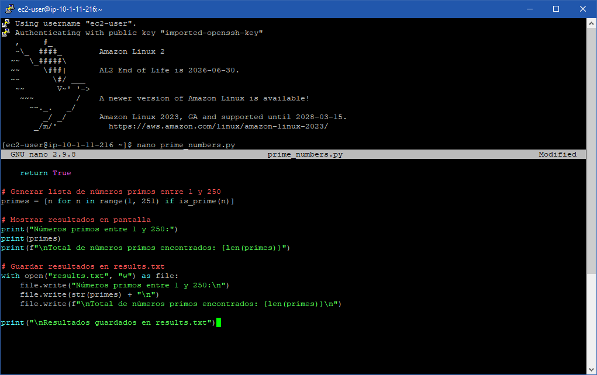
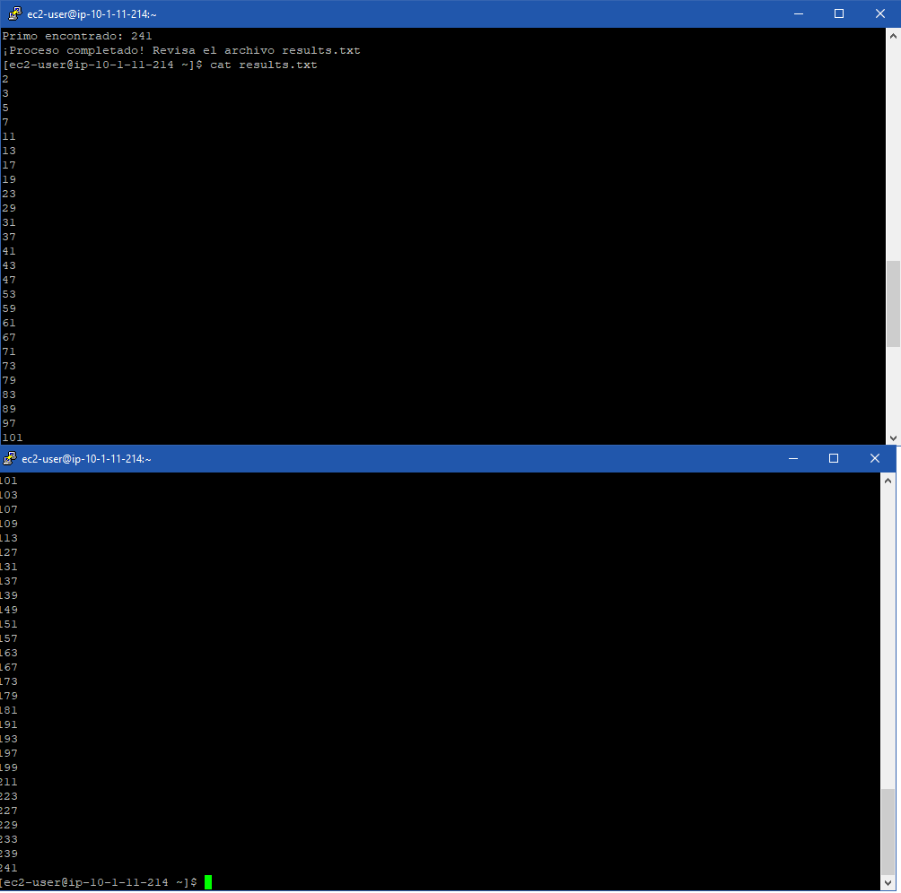

# Laboratorio 141: [Reto] Ejercicio de Scripting en Python (Números Primos)

**Dificultad:** Avanzada / Reto Integrador  
**Tiempo Estimado:** 40 minutos  
**Servicios Principales:** Amazon EC2, SSH (Secure Shell), Linux Terminal  

---

## 🎯 Resumen y Objetivos

A diferencia de las prácticas anteriores en un IDE gráfico (Cloud9), en este laboratorio te enfrentarás a un escenario del mundo real: conectarte de forma remota a un servidor Linux sin interfaz gráfica (headless) y desarrollar código directamente en su terminal. Al finalizar esta práctica, serás capaz de:
* Extraer las credenciales de acceso (llaves PEM/PPK) e IPs públicas desde la plataforma de laboratorio de AWS.
* Establecer una conexión segura vía SSH a una instancia Amazon EC2.
* Desarrollar un script en Python 3 que implemente lógica matemática compleja (identificación de números primos utilizando bucles anidados).
* Ejecutar el script por línea de comandos y redirigir/guardar la salida en un archivo de texto plano.

---

## 🔬 Análisis del Escenario

Como Ingeniero de Soporte Cloud, acceder a servidores mediante SSH es una de las habilidades más críticas de tu día a día. El diagnóstico de este reto indica la necesidad de comprobar el correcto aprovisionamiento de un entorno de ejecución de Python 3 dentro de una instancia EC2 (Linux Host). El cálculo de números primos es un excelente benchmark de CPU (prueba de rendimiento estresante para el procesador). Desarrollar un script puro que interactúe con el sistema de archivos (File I/O) para guardar los resultados demuestra la capacidad de automatizar reportes dentro del sistema operativo base.

---

## 🛠️ Desarrollo de las Tareas

### Tarea: Escribir el script de Números Primos
Debes escribir un código para identificar qué números son divisibles únicamente por 1 y por sí mismos, dentro del rango 1 al 250.

1. Ya conectado a la terminal del Linux Host, **abre** un editor de texto por línea de comandos (como `nano`) creando el archivo del script:
   ```bash
   nano primes_script.py
   ```
2. **Escribe** el siguiente código en Python 3:

<p align="center">
  
</p>

3. **Guarda** el archivo y **sal** del editor. En `nano`, presiona `Ctrl+O`, luego ENTER para confirmar, y finalmente `Ctrl+X` para salir.

### Tarea 4: Ejecutar y validar los resultados
1. Para obtener la ruta absoluta de tu script (como requiere el laboratorio), **ejecuta**:
   ```bash
   readlink -f primes_script.py
   ```
   *(Toma nota de esta ruta, usualmente será `/home/ec2-user/primes_script.py`).*
2. **Ejecuta** el script forzando la versión 3 de Python:
   ```bash
   python3 primes_script.py
   ```
3. **Verifica** el archivo de salida para asegurarte de que los resultados se escribieron correctamente, mostrando su contenido en pantalla:
   ```bash
   cat results.txt
   ```

<p align="center">
  
</p>

---

## 💡 Respuestas Analíticas

* **¿Cómo funciona la lógica del bloque `for ... else` en Python?**
  *Análisis:* Esta es una característica avanzada y peculiar de Python. En el bloque de código provisto para el reto, usamos `for i in range(2, num):`. Si el bucle iteró a través de todos los números sin encontrar ningún divisor (es decir, el bloque `if` jamás activó el comando `break`), la instrucción `else` adjunta al bucle `for` (no al `if`) se ejecuta. Es una forma extremadamente elegante de identificar un número primo sin necesitar banderas booleanas intermedias (ej. `es_primo = True`).
* **¿Por qué usamos `python3` explícitamente y no solo `python` en el Linux Host?**
  *Análisis:* En muchas imágenes del sistema operativo Amazon Linux (incluidas las AMI utilizadas en estos laboratorios de re/Start), `python` apunta por defecto a Python 2.7 por razones de compatibilidad con software antiguo del sistema (legacy). Invocar explícitamente `python3` asegura que el intérprete moderno gestione nuestro código, evitando fallos de sintaxis en funciones como el formateo de impresión (`print(f"...")`).

---