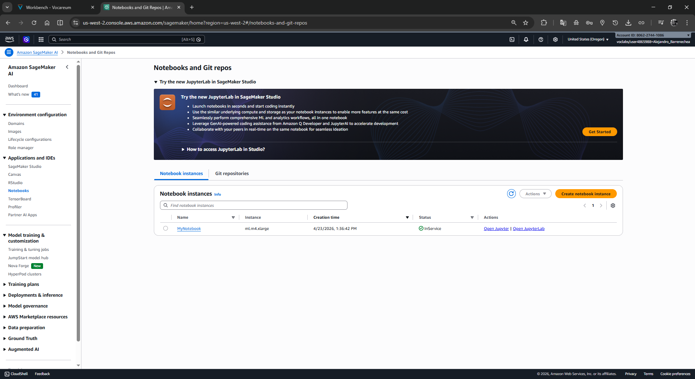
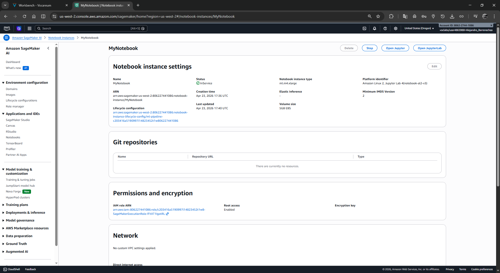
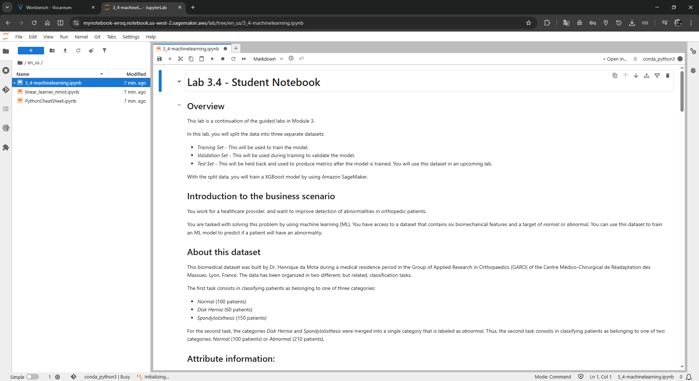
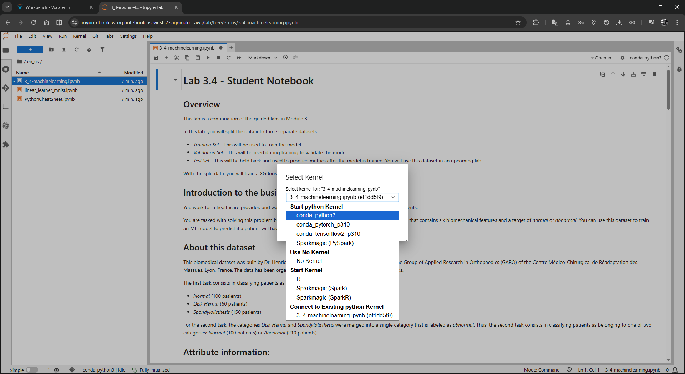

# Lab 316: Entrenamiento de un modelo de Machine Learning en Amazon SageMaker

| Parámetro | Detalle |
| :--- | :--- |
| **Dificultad** | Intermedia |
| **Tiempo Estimado** | 30 Minutos |
| **Servicios Principales** | Amazon SageMaker AI, Amazon S3, Algoritmo XGBoost |

---

## 1. Resumen y Objetivos
Este laboratorio práctico aborda el proceso de preparación y entrenamiento de un modelo de clasificación binaria utilizando el algoritmo **XGBoost** en Amazon SageMaker. El flujo de trabajo incluye la exploración de datos biomecánicos, su transformación para cumplir con los requisitos del algoritmo, la partición científica del dataset y la ejecución de un trabajo de entrenamiento en la nube de AWS.

**Al finalizar este laboratorio, serás capaz de:**
*   Dividir datos en subconjuntos de **entrenamiento, validación y prueba** mediante técnicas de estratificación.
*   Manipular DataFrames de Pandas para estructurar el formato de entrada de XGBoost.
*   Cargar datos a Amazon S3 utilizando búferes de memoria para optimizar la transferencia.
*   Configurar hiperparámetros y ejecutar un **Training Job** gestionado por SageMaker.

---

## 2. Análisis del Escenario
El equipo de salud requiere automatizar la detección de anomalías ortopédicas basadas en seis atributos biomecánicos derivados de la forma y orientación de la pelvis y la columna lumbar. El dataset presenta 210 pacientes con anomalías y 100 normales. Como Ingeniero de Machine Learning, debes asegurar que el modelo no sea sesgado; para ello, implementarás una división de datos que mantenga la proporción original de las clases en cada subconjunto, asegurando una evaluación fidedigna del rendimiento del modelo.

---

## 3. Arquitectura del Proceso
1.  **Ingesta:** Descarga y carga de datos `.arff` transformados a CSV.
2.  **Transformación:** Reordenamiento de la columna objetivo (`class`) a la posición 0.
3.  **Almacenamiento:** Repositorio en Amazon S3 organizado por carpetas (`train/`, `validate/`, `test/`).
4.  **Cómputo:** Entrenamiento distribuido en una instancia `ml.m4.xlarge` consumiendo imágenes Docker de ECR.

---

## 4. Desarrollo de las Tareas Paso a Paso

### Tarea 1: Acceso al entorno JupyterLab
1.  Navega a la consola de **Amazon SageMaker AI**.
2.  En el panel izquierdo, selecciona **Applications and IDEs** > **Notebooks** > **Notebook instances**.

<div align="center">
  
</div>

3.  Busca la instancia `MyNotebook` y haz clic en **Open JupyterLab**.

<div align="center">
  
</div>

### Tarea 2: Exploración y Preparación de Datos
Abre el notebook `3_4-machinelearning.ipynb` y ejecuta las celdas de inicialización para importar el dataset.

<div align="center">
  
</div>
<div align="center">
  
</div>

1.  **Analiza la forma del dataset:** Ejecuta la celda de exploración.
    *   **Resultado esperado:** `(310, 7)`.
    *   **Interpretación:** El dataset cuenta con 310 registros y 7 dimensiones técnicas.

2.  **Reordena las columnas para XGBoost:** SageMaker requiere que el *target* sea la primera columna. Ejecuta el código de reubicación y verifica:
    *   **Código:**
        ```python
        cols = df.columns.tolist()
        cols = cols[-1:] + cols[:-1]
        df = df[cols]
        ```
    *   **Resultado verificado:** La columna `class` ahora es el índice 0.

3.  **Realiza la partición de datos (Splitting):**
    *   Ejecuta la división estratificada (80% entrenamiento, 20% para test y validación).
    *   Divide el 20% restante en partes iguales (10% test, 10% validación).
    *   **Resultado de dimensiones:**
        ```bash
        (248, 7) # Train
        (31, 7)  # Test
        (31, 7)  # Validate
        ```

4.  **Verifica la distribución de clases:** Observa los conteos para asegurar la representatividad.
    *   **Resultado en Train:** 168 casos anormales (1) y 80 normales (0).

### Tarea 3: Carga de Datos a Amazon S3
1.  **Configura las variables de almacenamiento:** Define el bucket asignado por el laboratorio y los nombres de archivo (`vertebral_train.csv`, etc.).
2.  **Ejecuta la función `upload_s3_csv`:** Esta función convierte el DataFrame a CSV sin encabezados (`header=False`) ni índices, enviándolo directamente al bucket de S3.

### Tarea 4: Entrenamiento del Modelo
1.  **Obtén la imagen del contenedor:** El script recupera automáticamente la URI de la imagen de XGBoost versión `1.0-1` según tu región.
2.  **Establece los hiperparámetros:**
    ```python
    hyperparams={"num_round":"42", "eval_metric": "auc", "objective": "binary:logistic"}
    ```
3.  **Configura el Estimador:** Selecciona una instancia `ml.m4.xlarge` y asigna el rol de ejecución.
4.  **Inicia el Training Job:** Ejecuta la celda `xgb_model.fit()`. Monitoriza el estado del trabajo.

**Evidencia de ejecución exitosa:**
```text
2026-04-23 17:56:13 Starting - Starting the training job..
2026-04-23 17:58:17 Training - Training image download completed. Training in progress.....
2026-04-23 17:58:56 Completed - Training job completed
```

---

## 5. Respuestas Analíticas

*   **¿Cuál es la función del parámetro `stratify=df['class']` en este laboratorio?**
    Dado que el dataset es pequeño (310 registros), una división puramente aleatoria podría dejar un subconjunto sin suficientes ejemplos de la clase "Normal". La estratificación garantiza que el 68% de casos "Abnormal" y el 32% de "Normal" se mantengan proporcionales en los sets de entrenamiento, prueba y validación, evitando el sesgo del modelo.

*   **¿Por qué se configuran `header=False` e `index=False` al subir a S3?**
    El algoritmo XGBoost implementado en SageMaker espera archivos CSV puros donde la primera columna sea el valor objetivo y las siguientes las características, sin metadatos adicionales como nombres de columnas o índices de Pandas, que causarían errores de lectura durante el entrenamiento.

*   **Análisis de Hiperparámetros: ¿Por qué `objective: binary:logistic`?**
    Debido a que el escenario plantea una clasificación binaria (Normal vs Abnormal), este objetivo instruye al modelo para que devuelva una probabilidad logística, la cual es ideal para problemas donde la salida debe ser una clasificación entre dos categorías mutuamente excluyentes.

---
**Resultado Final:** El modelo ha sido entrenado exitosamente y el artefacto `model.tar.gz` se encuentra disponible en S3 para su posterior despliegue.